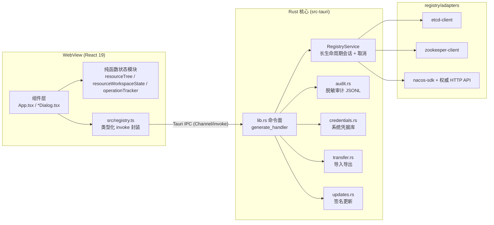

# Atlas Registry 架构

本文描述代码的实际结构与设计不变量，供维护者和 AI 协作工具在动手前建立正确的心智模型。技术选型的历史背景见 [ADR-0001](ADR-0001-TAURI-PURE-RUST.md)。

## 进程模型

单进程 Tauri 2 应用：React 19 WebView 负责交互，Rust 负责一切网络、凭据、磁盘 IO。WebView 的 CSP 禁止访问任何外部网络（`connect-src ipc:`），与注册中心的连接全部由 Rust 持有。

## 前端结构

三层分工，新代码必须遵守：

1. **纯函数状态模块**（`src/resourceTree.ts`、`src/resourceWorkspaceState.ts`、`src/operationTracker.ts`、`src/profileSelection.ts`、`src/registryError.ts`、`src/updateSettings.ts`）：不依赖 React，承载全部可测试的状态转换逻辑；`scripts/*.test.mjs` 直接转译并断言这些模块。
2. **Hook 组合层**（`src/useResourceWorkspace.ts`、`src/useRegistryOperations.ts`）：把纯函数模块与 IPC 调用、取消、乐观状态接到 React 上。
3. **组件层**（`src/App.tsx` 与各 `*Dialog.tsx`）：渲染与事件接线，不写业务规则。

`src/registry.ts` 是前端唯一允许出现 `invoke` 的文件。它给每个 Rust 命令一个类型化函数，watch 等流式结果通过 `Channel` 回调。

## IPC 契约

- 跨 IPC 的 Rust DTO 标注 `#[cfg_attr(test, derive(ts_rs::TS))]` + `#[cfg_attr(test, ts(export))]`，主要定义在 [src-tauri/src/registry.rs](../src-tauri/src/registry.rs)。
- `npm run generate:contracts` 先清空 `src/generated/` 再跑 `cargo test export_bindings` 重新导出。
- CI（quality.yml）在跑完 Rust 测试后执行 `scripts/verify-generated-contracts.mjs`：`src/generated/` 有任何未提交差异即失败。生成文件必须随 Rust 改动一起提交，且不参与 Prettier 格式化。
- 序列化统一 `camelCase`（`#[serde(rename_all = "camelCase")]`），64 位整数（如 etcd lease ID）以十进制字符串传输。

## Rust 核心

### 命令面与状态

[lib.rs](../src-tauri/src/lib.rs) 定义全部 `#[tauri::command]` 并通过 `configured_builder` 注入 managed state：`RegistryService`（协议会话）、`AuditLog`、`CredentialVault`、`TransferService`、`PendingAppUpdate`。命令必须同时出现在四处：`generate_handler![]`、`build.rs` 的 `COMMANDS`、`capabilities/default.json` 的 `allow-*`、`src/registry.ts` 封装——缺一处即编译期或运行期失败，防止命令面漂移。

### 领域模型与适配器

[registry.rs](../src-tauri/src/registry.rs) 定义 `RegistryCatalog`（adapter descriptor 与能力声明）、`RegistryService`（会话表、操作取消、监听注册）以及全部 DTO 与校验。`registry/` 子模块按职责拆分：

| 模块                                 | 职责                                                                                      |
| ------------------------------------ | ----------------------------------------------------------------------------------------- |
| `registry/adapters.rs` + `adapters/` | 三协议客户端封装成统一的 `RegistrySession`，含 Nacos 用户密码、MSE AccessKey 与自定义鉴权 |
| `registry/mutations.rs`              | 条件变更执行与前后快照                                                                    |
| `registry/watch.rs`                  | 监听生命周期、断线恢复、Nacos 5 秒 MD5 对账                                               |
| `registry/nacos_native.rs`           | namespace / service / instance 管理与有界回读确认                                         |

`audited_mutation.rs` 把「写前审计 → 远端变更 → 写后审计」编排成一个不可跳过的流程；所有 mutation 命令都经过它。

### 协议差异的处理原则

通用能力只统一「连接 + 资源浏览 / 读写 / 监听」的外形；lease、transaction、ACL、节点模式、namespace、service、instance 保持原生语义，各有独立命令与 UI 入口。抹平差异的抽象是被明确否决的方向。

## 安全边界

| 边界         | 机制                                                                                                                                                                          |
| ------------ | ----------------------------------------------------------------------------------------------------------------------------------------------------------------------------- |
| WebView 权限 | CSP 禁外联；capability 只授权 `main` 窗口调用应用命令（[tauri.conf.json](../src-tauri/tauri.conf.json)、[capabilities/default.json](../src-tauri/capabilities/default.json)） |
| 凭据         | 密码、token、MSE AccessKey Secret 只进系统凭据库（`keyring`），连接配置文件不含 secret；临时凭据仅存活于当前连接，`zeroize` 擦除                                              |
| 审计         | `mutation-audit.jsonl` 记录版本 / 大小 / 编码 / SHA-256 摘要，不记录 value、密码、token；started 事件先于远端变更同步落盘                                                     |
| 诊断包       | 只含运行时版本、adapter 能力、聚合连接计数；由 sentinel 测试（`diagnostics.rs`）禁止出现连接名 / endpoint / namespace / 凭据                                                  |
| 更新         | 只访问 GitHub Releases 的 `latest.json`，minisign 签名验证不可关闭，下载安装全在 Rust 侧                                                                                      |

## 关键不变量

破坏以下任何一条都是回归，评审与测试都以此为准：

1. **有界 IO**：内联 value ≤ 1 MiB；浏览 / 搜索 / 历史分页且带游标；审计读取从文件尾部倒序、每页扫描 ≤ 512 KiB；ZooKeeper 单父节点支持到 100k 直接子节点，超界返回 `resourceExhausted` 而不是扫描。
2. **条件变更**：etcd revision、ZooKeeper version/aversion、Nacos MD5 / SHA-256 指纹；Nacos 管理 API 无 CAS，采用「读时指纹比较 + 写后有界回读确认（≤ 20 次 × 200 ms）」并在 UI 明示竞争窗口。
3. **结果不确定性诚实上报**：取消 / 超时 / 提交后传输错误 → `mutationOutcomeUnknown`，不自动重试；远端成功但审计落盘失败 → `auditIncomplete`，两者不得混淆。
4. **Nacos SDK cache 不可信**：配置正文读取、写前检查、写后确认、周期对账一律走版本对应的权威 HTTP API；SDK 只承担 gRPC mutation、listener 与临时实例 session（原因见 ADR-0001 上游约束）。
5. **MSE 签名路径一致**：SDK Config/Naming 身份上下文与权威 HTTP API 共享 AccessKey 生命周期和 HMAC-SHA1 规则，但分别遵循 SDK `RequestResource` 与 HTTP 参数的资源规范化语义；HTTP Config 在 namespace 非空时保留空 group 分隔符。AK Secret 不进入 URL、连接配置或日志。
6. **取消安全**：长操作挂在 `CancellationToken` 上；审计追加在独立任务中 `write_all + sync_data`，不被取消切断。

## 测试体系

| 层              | 位置                                                                                                | 触发                          |
| --------------- | --------------------------------------------------------------------------------------------------- | ----------------------------- |
| 前端行为 / 契约 | `scripts/*.test.mjs`（`node --test`，转译纯函数模块直接断言；契约测试对源码做空白不敏感的正则匹配） | `npm run test:ui`，每次 CI    |
| Rust 单元       | 各模块 `#[cfg(test)]`，含诊断脱敏 sentinel、DTO 校验                                                | `cargo test`，每次 CI         |
| 命令面 mock     | `lib.rs::command_tests` 用 `tauri::test` 起 mock app 验证命令注册与非法输入                         | `cargo test`，每次 CI         |
| 真实服务契约    | `src-tauri/tests/live_registry.rs`（ignored；环境变量控制协议、TLS、fixture、mutation 循环）        | 手动 / compatibility workflow |
| 兼容矩阵        | `scripts/compatibility-test.sh` 起临时容器跑六个协议版本                                            | 每周 + 主干相关变更           |
| 平台安装验证    | quality.yml 在三平台构建并真实安装 DEB / AppImage / MSI / NSIS / DMG                                | 每次 CI                       |

## CI / 发布

- [quality.yml](../.github/workflows/quality.yml)：三平台执行 rustfmt、clippy `-D warnings`、Rust 测试、契约漂移检查、前端 build / lint / format / 行为测试、安装包构建与安装验证。
- [compatibility.yml](../.github/workflows/compatibility.yml)：六项真实服务契约。
- [release.yml](../.github/workflows/release.yml)：仅响应与应用版本一致的 `vX.Y.Z` tag，产出四平台 Draft Release；签名、公证与公开发布检查见 [RELEASING.md](RELEASING.md)。
